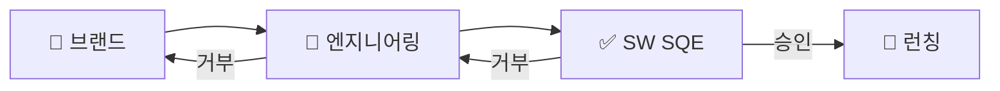

# 자동차 앱 온보딩 - 부서별 책임 매트릭스

## 📊 프로세스 흐름 요약
```
🎨 브랜드 디자이너 → 🔧 엔지니어링 부서 → ✅ SW SQE → 🚀 최종 승인
```

---

## 📋 12개 평가 항목별 주담당 부서

| # | 평가 항목 | 🎨 브랜드<br/>디자이너 | 🔧 엔지니어링<br/>부서 | ✅ SW SQE | 단계 |
|---|---------|:---:|:---:|:---:|:---:|
| 1 | **계약서 및 법적 문서** | 🟡 지원 | 🟡 지원 | 🔴 **주담당** | 3단계 |
| 2 | **회사 신뢰도 조사** | 🟡 지원 | 🟡 지원 | 🔴 **주담당** | 3단계 |
| 3 | **앱 복잡도 분석** | 🟡 지원 | 🔴 **주담당** | 🟡 지원 | 2단계 |
| 4 | **신규 앱 상세 분석** | 🟡 지원 | 🟡 지원 | 🔴 **주담당** | 3단계 |
| 5 | **사이버 보안** | 🟡 지원 | 🔴 **주담당** | 🟡 지원 | 2단계 |
| 6 | **개발 방법론** | 🟡 지원 | 🟡 지원 | 🔴 **주담당** | 3단계 |
| 7 | **OWASP 모바일 보안** | 🟡 지원 | 🔴 **주담당** | 🟡 지원 | 2단계 |
| 8 | **APK 파일 검사** | 🟡 지원 | 🔴 **주담당** | 🟡 지원 | 2단계 |
| 9 | **앱 권한 분석** | 🟡 지원 | 🔴 **주담당** | 🟡 지원 | 2단계 |
| 10 | **기술 설계 리뷰 (EDR)** | 🟡 지원 | 🔴 **주담당** | 🟡 지원 | 2단계 |
| 11 | **생명주기 품질 관리** | 🟡 지원 | 🟡 지원 | 🔴 **주담당** | 지속 |
| 12 | **개발자 포털 요구사항** | 🟡 지원 | 🟡 지원 | 🔴 **주담당** | 3단계 |

---

## 🔄 단계별 상세 프로세스

### 1️⃣ 1단계: 브랜드 디자이너 (요구사항 정의)
**주요 활동:**
- 📝 브랜드 요구사항 분석
- 🎯 UX/UI 가이드라인 검토
- 📊 브랜드 적합성 평가
- 🎨 디자인 표준 준수 확인

**결과물:**
- ✅ 브랜드 승인/거부 결정
- 📋 요구사항 명세서
- 🎨 디자인 가이드라인

---

### 2️⃣ 2단계: 엔지니어링 부서 (기술 검증)
**주요 활동:**
- 🏗️ **기술 아키텍처 리뷰 (EDR)** - 항목 10
- 🔒 **APK 스캔 및 보안 검증** - 항목 8
- 🔐 **권한 분석** - 항목 9
- ⚡ **성능 테스트 및 복잡도 분석** - 항목 3
- 🛡️ **사이버보안 및 OWASP 검증** - 항목 5, 7
- 🔗 **통합 테스트 및 호환성 검증**

**결과물:**
- ✅ 기술 승인/거부 결정
- 📊 성능 테스트 보고서
- 🔒 보안 검증 보고서

---

### 3️⃣ 3단계: SW SQE (최종 품질 확인)
**주요 활동:**
- 🏢 **공급업체 품질 평가** - 항목 2
- 📋 **법적 문서 검토** - 항목 1
- 💻 **개발 방법론 검토** - 항목 6
- 📱 **신규앱 상세분석** - 항목 4
- 🌐 **개발자포털 준수 확인** - 항목 12
- 🎯 **전체 품질 기준 최종 검증**

**결과물:**
- ✅ 최종 품질 승인/거부 결정
- 📋 품질 평가 보고서
- 📊 종합 평가 결과

---

## 🚨 중요 체크포인트

### 🔴 필수 통과 항목 (절대 타협 불가)
- **항목 8: APK 파일 검사** (바이러스/악성코드)
- **항목 9: 앱 권한 분석** (시스템 접근 권한)
- **항목 10: 기술 설계 리뷰** (아키텍처 검증)

### 🟡 협업 필수 항목
- **항목 1: 계약서** (법무팀과 협업)
- **항목 5: 사이버보안** (보안팀과 협업)
- **항목 11: 생명주기 관리** (운영팀과 협업)

---

## ⏱️ 예상 소요 시간

| 단계 | 소요 시간 | 주요 활동 |
|:---:|:---:|:---|
| **1단계** | 1-2주 | 브랜드 요구사항 정의 및 승인 |
| **2단계** | 2-4주 | 기술 검증 및 보안 테스트 |
| **3단계** | 1-2주 | 품질 확인 및 최종 승인 |
| **총 기간** | **4-8주** | 프로젝트 복잡도에 따라 변동 |

---

## 🔄 피드백 루프



각 단계에서 거부 시 이전 단계로 피드백하여 수정 후 재검토 진행
